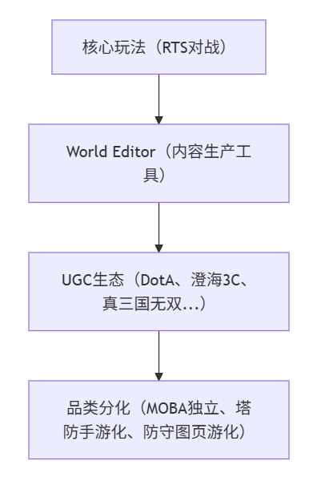
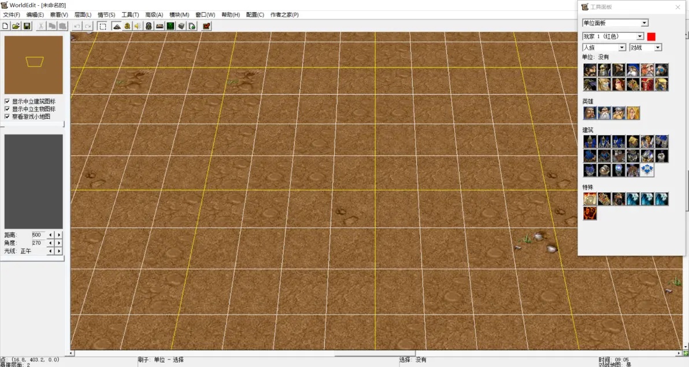
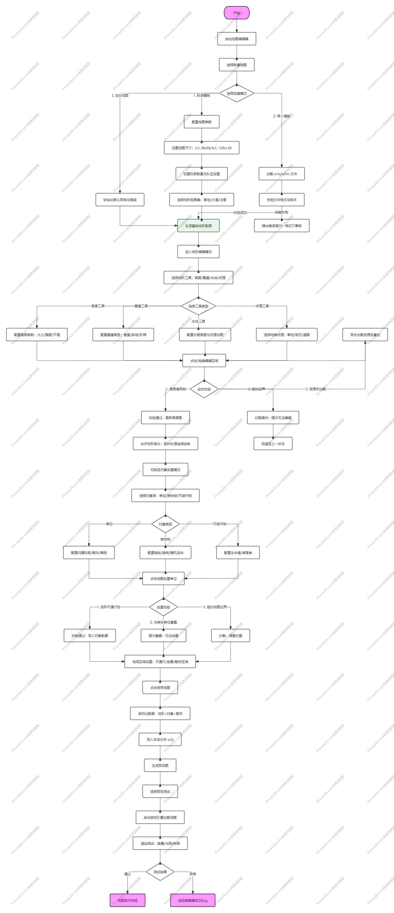
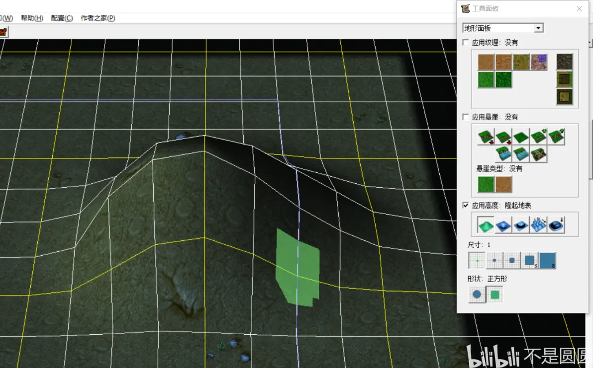
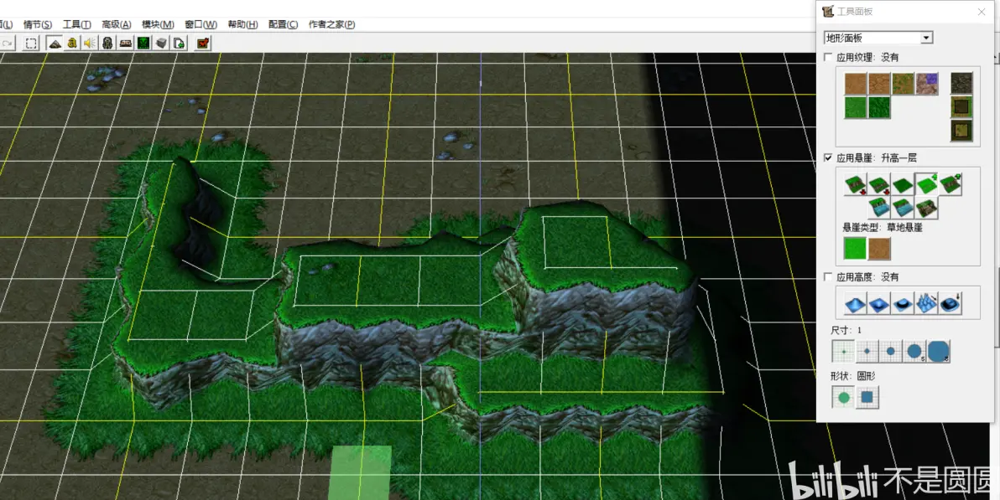
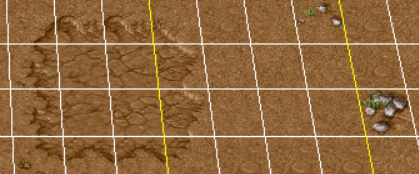
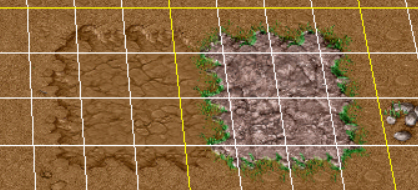
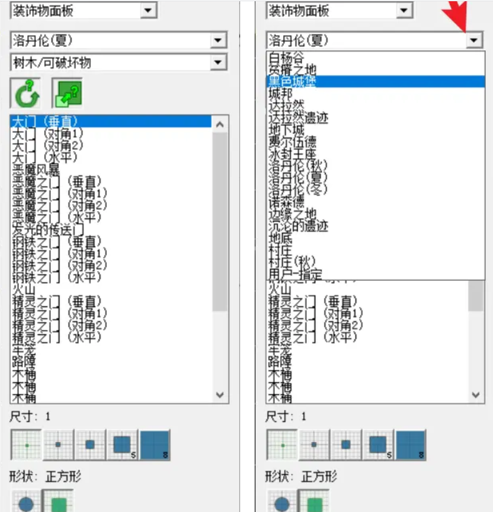
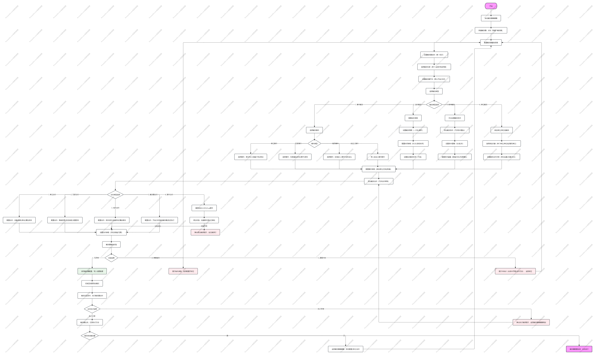
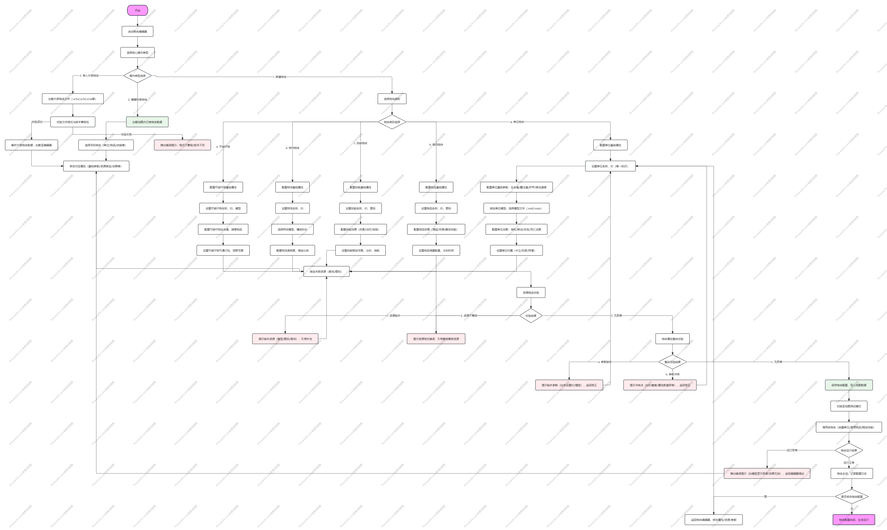

## 目录

### 一、整体概述
- [1. 编辑器基础信息](#1-编辑器基础信息)
- [2. 设计目的](#2-设计目的)
- [3. 技术架构与性能表现](#3-技术架构与性能表现)
- [4. 用户界面与操作体验](#4-用户界面与操作体验)

### 二、核心功能拆解
- [1. 地形编辑系统](#1-地形编辑系统)
  - [1.1 系统定位与战略价值](#11-系统定位与战略价值)
  - [1.2 技术架构与核心机制](#12-技术架构与核心机制)
    - [1.2.1 网格系统](#121-网格系统)
    - [1.2.2 层级（Cliff Level）系统](#122-层级cliff-level-系统)
    - [1.2.3 纹理与材质系统](#123-纹理与材质系统)
    - [1.2.4 水体与装饰物系统](#124-水体与装饰物系统)
  - [1.3 实际案例深度分析](#13-实际案例深度分析)
    - [1.3.1 成功案例：DOTA的河道与高地设计](#131-成功案例dota的河道与高地设计)
  - [1.4 优缺点深度评估](#14-优缺点深度评估)
    - [1.4.1 优势分析](#141-优势分析)
    - [1.4.2 劣势分析](#142-劣势分析)
  - [1.5 对现代游戏编辑器的设计启示](#15-对现代游戏编辑器的设计启示)
  - [1.6 结语](#16-结语)
- [2. 物体编辑器](#2-物体编辑器)
  - [2.1 系统定位与战略价值](#21-系统定位与战略价值)
  - [2.2 技术架构与核心机制](#22-技术架构与核心机制)
    - [2.2.1 字段系统（Field System）](#221-字段系统field-system)
- [3. 触发器编辑系统](#3-触发器编辑系统)
  - [3.1 系统定位与战略价值](#31-系统定位与战略价值)
  - [3.2 技术架构与核心机制](#32-技术架构与核心机制)
    - [3.2.1 事件-条件-动作（ECA）架构](#321-事件-条件-动作eca-架构)
    - [3.2.2 执行模型与并行机制](#322-执行模型与并行机制)
    - [3.2.3 Wait动作的陷阱](#323-wait动作的陷阱)
    - [3.2.4 变量系统与数据管理](#324-变量系统与数据管理)
    - [3.2.5 JASS与LUA：脚本系统的演进](#325-jass与lua脚本系统的演进)
  - [3.3 实际案例深度分析](#33-实际案例深度分析)
    - [3.3.1 防守RPG案例：《火影忍者羁绊》的忍术连携系统](#331-防守rpg案例火影忍者羁绊的忍术连携系统)
    - [3.3.2 生存类案例：《侏罗纪公园》的生态系统模拟](#332-生存类案例侏罗纪公园的生态系统模拟)
    - [3.3.3 剧情RPG案例：《小兵的故事》的多线叙事系统](#333-剧情rpg案例小兵的故事的多线叙事系统)
  - [3.4 优缺点深度评估](#34-优缺点深度评估)
  - [3.5 对现代游戏编辑器的设计启示](#35-对现代游戏编辑器的设计启示)

[打开思维导图](files/markmap.html)

## 一、整体概述

### 1. 编辑器基础信息

| 项目 | 详情 |
|------|------|
| **名称** | 魔兽地图编辑器（Warcraft III World Editor） |
| **类型** | 特定游戏编辑器（魔兽争霸3专用地图编辑器） |
| **厂商** | 暴雪娱乐（Blizzard Entertainment） |
| **版本历史** | 随魔兽争霸3一起发布，经历了从1.00到1.32.10的多个版本更新。最初于2002年随游戏正式版发布，之后随着游戏版本迭代不断更新，最近一次重大更新是2020年的重制版（Reforged）版本。 |
| **核心功能** | 地形编辑、单位放置、触发器编辑、资源管理、脚本编程。这些功能构成了一个完整的地图制作生态系统，允许用户从无到有创建完整的游戏地图。 |
| **技术架构** | 基于魔兽争霸3游戏引擎，采用C++开发，内置JASS脚本语言作为扩展工具。编辑器与游戏引擎深度集成，确保编辑效果与游戏运行效果一致。 |
| **跨平台支持** | 仅支持Windows平台。由于游戏本身的限制，编辑器无法在其他操作系统上运行，这在一定程度上限制了其用户群体。 |
| **性能表现** | 对硬件要求较低，运行稳定。即使在现代硬件上，编辑器也能保持流畅运行，适合各种配置的电脑使用。 |

### 2. 设计目的

#### 核心定位
降低RTS游戏开发门槛，让玩家无需编程基础即可创建自定义内容，延长产品生命周期并构建UGC生态。

#### 具体目标
- **简化游戏开发**：让非专业开发者也能实现完整游戏逻辑
- **品类孵化器**：通过工具开放性催生全新玩法品类（MOBA、自走棋、塔防）
- **社区自持续**：依赖用户创造内容维持游戏热度，减少官方内容更新压力

#### 达成路径
- **可视化脚本（触发器）**：替代代码编写，降低技术门槛
- **数据驱动的物体编辑器**：支持深度定制游戏元素
- **资源打包系统（MPQ）**：允许完整资产替换，实现个性化内容

#### 系统定位
[](files/flow-1.png)


#### 资源循环定位
编辑器本身是零产出消耗系统——不直接产生营收，但通过延长游戏生命周期间接提升本体销量和战网活跃度。

#### 体验定位
高上限、高下限——简单拖拽即可做地图，但精通需要理解内存管理、触发器优化等底层机制。

### 3. 技术架构与性能表现

| 技术指标 | 详情 | 影响 |
|----------|------|------|
| **底层技术栈** | 基于魔兽争霸3游戏引擎，内置JASS脚本语言 | 确保编辑与游戏运行的一致性，提供灵活的扩展能力 |
| **渲染性能** | 基于DirectX 8.1，适合游戏内渲染 | 虽然技术较老，但足以满足魔兽争霸3的渲染需求 |
| **内存管理** | 对内存要求较低，适合老机器运行 | 提高了编辑器的普及度，降低了硬件门槛 |
| **加载速度** | 地图加载速度取决于地图大小和复杂度 | 大型地图可能需要较长的加载时间，影响编辑效率 |
| **扩展性** | 有限的官方API，但有第三方工具扩展 | 官方功能有限，但第三方工具如YDWE提供了丰富的扩展 |

### 4. 用户界面与操作体验

| 界面要素 | 详情 | 用户体验 |
|----------|------|----------|
| **工作区组织** | 多窗口布局，包括地形编辑器、单位面板、触发器编辑器等 | 功能分区明确，便于用户快速找到所需工具 |
| **面板设计** | 功能分区明确，操作便捷 | 降低了学习成本，提高了编辑效率 |
| **导航系统** | 2D网格导航，支持缩放和平移 | 便于用户在大型地图中快速定位和操作 |
| **操作方式** | 拖拽操作、快捷键支持、可视化编程 | 提供多种操作方式，满足不同用户的习惯 |
| **自定义能力** | 支持窗口布局自定义，可根据个人习惯调整工作流 | 提高了用户的工作效率和舒适度 |
| **多视图支持** | 2D地形编辑视图和3D游戏预览视图 | 便于用户在编辑过程中实时预览效果 |
| **响应速度** | 在现代硬件上运行流畅，操作响应迅速 | 提供了良好的编辑体验，减少了等待时间 |



## 二、核心功能拆解

### 1. 地形编辑系统

#### 1.1 系统整体框架
[](files/flow-2.png)

#### 1.2 系统定位与战略价值

地形编辑系统是World Editor（以下简称WE）的**三大支柱之一**（地形、触发器、物体编辑器），它承担着**空间叙事的基础构建**功能。与触发器（时间维度控制）和物体编辑器（实体属性配置）不同，地形系统定义了**玩家的空间体验边界**——它决定了视野如何被控制、移动路径如何被规划、战术纵深如何被构建。

从游戏设计理论角度，WE的地形系统实现了**"环境即玩法"**（Environment as Gameplay）的设计理念。在2002年的设计语境下，这是一种超前认知：暴雪意识到RTS地图不仅是"背景板"，而是**可玩性的直接载体**。

**显性目标**：
- 提供直观的地形塑造工具，支持从平原到山地的多样化地貌
- 实现RTS游戏所需的战术空间（高地优势、狭窄choke points、视野盲区）

**隐性目标**：
- **降低美术门槛**：让非美术背景的设计师（如架势、无良等开发者）也能创建专业级关卡
- **支持快速迭代**：可视化编辑、实时预览，缩短"构思-验证-调整"循环
- **确保运行时性能**：2002年的硬件环境下，地形渲染必须高效

**战略价值**：
地形系统的开放性直接催生了**MOBA品类**。DOTA的河道高低差设计、真三国无双的卡视野机制、澄海3C的命运房间——这些核心玩法都建立在WE地形系统的能力边界之内。可以说，**没有WE的地形系统，就没有现代MOBA**。

#### 1.3 核心机制

##### 1.3.1 网格系统

1. **混合地形风格**：同一地图内可同时存在平滑丘陵（低顶点密度变化）和陡峭悬崖（高顶点密度变化），这是基于网格系统难以实现的
2. **动态地形动画**：支持运行时修改顶点高度，实现地震、桥梁升降、地形破坏等效果
3. **自动过渡算法**：根据顶点法线自动混合相邻纹理，减少美术手工绘制工作量



**与同时代技术的对比**：

| 引擎/编辑器 | 地形系统 | 设计师限制 |
|-----------|---------|---------|
| 星际争霸1编辑器（1998） | 纯2D网格，无高度概念 | 无法实现任何Z轴战术 |
| 帝国时代2编辑器（1999） | 基于单元格的高度台阶 | 高度变化生硬，无平滑过渡 |
| **War3 WE（2002）** | **顶点级高度+层级系统** | **悬崖类型硬编码限制为2种** |
| 虚幻引擎2（2002） | 高度图（Heightmap） | 需要外部工具编辑，非实时 |

##### 1.3.2 层级（Cliff Level）系统

层级系统是WE地形系统的**独特创新**。它并非简单的"高度值"，而是将地形划分为离散的**逻辑层级**，每个层级代表一个**可行走的平面**。


**核心机制**：
- **层级内平滑**：同一层级内的顶点可通过高度值实现平滑起伏
- **层级间陡峭**：相邻顶点的层级差>1时，自动生成垂直悬崖几何体
- **自动坡道（Ramp）生成**：连接不同层级的可行走通道，导航系统自动识别

**设计师应用**：
- **高地视野优势**：层级2的单位可看到层级1的单位，但反之不行（除非有飞行视野）
- **不可通行屏障**：悬崖层级差阻止地面单位移动，形成天然choke points
- **战术纵深设计**：通过层级组合创建"高地-斜坡-低地"的三层战术空间

**局限性的技术根源**：
**硬编码的悬崖类型限制**（2种有效渲染）源于**渲染管线的纹理采样限制**。2002年的DirectX 8.1固定功能管线中，悬崖的侧面纹理需要在单个draw call中完成，而硬件纹理单元有限。同时地形向下深度最多也只有两层

**对设计师的制约**：
- 无法设计"地下城多层结构"（如D&D风格的地下三层迷宫）
- 无法实现"悬崖上的悬崖"（如悬挂在峭壁上的平台）
- 复杂垂直空间必须通过**装饰物模拟**（如用树木、建筑遮挡实现"伪层级"）

##### 1.3.3 纹理与材质系统

WE的纹理系统采用**基于相邻顶点法线的自动混合算法**：

1. 计算每个顶点的法线方向
2. 根据法线坡度选择基础纹理（草地、岩石、泥土）
3. 在三角形内部根据顶点权重混合相邻纹理
4. 特殊过渡纹理（如"草地到岩石的过渡"）自动应用于边界区域


----->


**设计师价值**：
- **降低美术门槛**：无需手动绘制纹理过渡，系统自动处理
- **保持一致性**：避免人工绘制时的风格不统一
- **快速迭代**：修改地形高度后，纹理自动重新计算

**瓦片集（Tileset）限制**：
**16种瓦片集上限**是WE地形系统的**资源约束**。每种瓦片集包含：
- 基础纹理（草地、泥土等）
- 悬崖纹理（侧面、顶部）
- 过渡纹理（与其他瓦片集的混合）

**设计师影响**：
- 大型地图（如8人地图）必须在**视觉多样性**和**性能**间权衡
- 自定义地图（如DOTA）通常只使用1-2种瓦片集以保持风格统一
- 跨瓦片集过渡需要谨慎规划，避免"纹理接缝"视觉BUG

##### 1.3.4 水体与装饰物系统

WE的水体系统采用**遮罩（Mask）+ 深度图**的简化方案：

- **浅水实现**：通过抬升地形（层级0但高度>0）+ 水面遮罩
- **深水实现**：层级-1（水下）+ 水面遮罩
- **无真实流体动力学**：水面是静态平面，无波浪、无浮力模拟

**设计师应用与局限**：
- **DOTA河道**：利用浅水遮罩创建"可涉水但减速"的战术区域
- **无法游泳**：无潜水机制，水下只是"另一个地面层"
- **瀑布效果**：必须通过粒子特效（装饰物）模拟，非真实水体流动

**装饰物（Doodad）的补偿作用**：
装饰物系统弥补了地形系统的**几何表达能力不足**：
- **树木**：用于视野遮挡（卡视野机制）
- **岩石/建筑**：用于填补悬崖几何体的生硬边缘
- **粒子特效**：用于水体、火焰等动态效果



**关键洞察**：WE的地形系统与装饰物系统是**协同设计**的——地形负责**宏观空间结构**，装饰物负责**微观视觉细节和玩法补充**。

#### 1.4 实际案例深度分析

##### 1.4.1 成功案例：DOTA的河道与高地设计

**设计意图**：
IceFrog（DOTA核心设计师）充分利用WE地形系统的**层级视野机制**，创造了MOBA品类的核心战术空间：

**河道设计**：
- **层级策略**：河道为层级0，两侧河岸为层级1
- **视野控制**：站在河岸（层级1）的单位可获得河道内（层级0）的视野优势
- **战术后果**：控制河岸=控制河道视野=控制Roshan（中立BOSS）区域

**高地设计**：
- **层级策略**：防御塔位于层级2，进攻路线为层级1→层级0→层级1
- **视野控制**：高地单位可看到低地单位，反之不行
- **战术后果**：防守方拥有"视野不对称优势"，进攻方需承担"盲上高地"的风险

**技术实现细节**：
**地形数据**（基于社区反编译分析）：
- 地图尺寸：118×120（小型地图，确保战斗密度）
- 层级分布：0（河道）、1（主路线）、2（高地/野区）
- 纹理策略：单一瓦片集（"洛丹伦夏天"），保持视觉一致性
- 装饰物密度：河道两侧密集树木（视野遮挡），野区稀疏（便于侦查）

**设计师启示**：
DOTA的成功证明了WE地形系统的**设计上限**：
- **极简主义**：仅用3个层级创造了丰富的战术空间
- **对称性**：镜像地形确保双方公平，但通过对称打破（如Roshan位置）创造动态目标
- **可读性**：地形高度变化直观可见，玩家无需学习即可理解"高地=优势"

**关键洞察**：好的地形设计不需要复杂的技术，而是需要**对机制的深度理解**——IceFrog将WE的层级系统转化为"信息不对称"的游戏机制。

#### 1.5 优缺点深度评估

##### 1.5.1 优势分析

**设计哲学优势**：

1. **"所见即所得"的迭代效率**
WE地形系统的**实时预览**能力在2002年具有革命性：
- 修改高度后立即看到3D效果
- 纹理自动过渡减少等待时间
- 快速测试（Ctrl+F9）支持"编辑-测试-调整"分钟级循环

**对比现代引擎**：Unity Terrain的烘焙流程、Unreal的构建时间，在迭代效率上反而落后于WE的即时反馈。

2. **层级系统的战术深度**
层级（Cliff Level）机制将**空间信息**转化为**游戏机制**：
- 高地视野优势成为RTS/MOBA的核心策略
- 自动坡道生成确保AI和玩家均可导航
- 层级差阻止移动但允许远程攻击，创造"地形杀"可能

**设计理论支撑**：符合Jesse Schell的"透镜#27：空间透镜"——游戏空间应支持有意义的决策。

3. **自动过渡算法的美术简化**
自动纹理混合降低了**技术美术门槛**：
- 设计师无需理解UV映射、纹理采样
- 系统自动处理接缝和过渡
- 支持快速风格实验（更换瓦片集即可改变整体风格）

**社区成果**：这一设计使得2000年代的中国大学生（如无念、无良）能够独立创建视觉专业的地图。

##### 1.5.2 劣势分析

**架构级局限**：

1. **悬崖类型的硬编码限制（致命缺陷）**
**技术根源**：DirectX 8.1固定功能管线的纹理单元限制

**设计师影响**：
- 无法设计超过2层垂直高度的复杂关卡（如多层地下城、悬挂城市）
- 迫使开发者使用"装饰物欺骗"（如用建筑模拟平台），增加性能成本
- 2025年Hive Workshop社区仍将此列为"最希望移除的限制"

**对比现代引擎**：Unity/Unreal无悬崖类型概念，支持任意复杂度的地形雕刻。

2. **水体系统的简化**
**技术妥协**：遮罩+深度图方案无法实现：
- 真实流体动力学（波浪、浮力）
- 水下视觉效果（折射、焦散）
- 水体交互（游泳、潜水）

**设计师影响**：
- 水域只能是"可行走的减速区域"或"不可行走的装饰"
- 无法实现"水下战斗"、"船只载具"等机制
- DOTA的河道是"浅水"，真三国无双完全回避水域设计

3. **瓦片集的资源限制**
**16种瓦片集上限**在2002年可能是性能优化，但在现代视角下：
- 大型地图的视觉多样性受限
- 跨瓦片集过渡需要谨慎规划，增加设计师认知负荷
- 自定义瓦片集需要复杂的MPQ文件替换流程

**工具链缺陷**：

1. **缺乏程序化生成工具**
WE地形系统**完全手动编辑**：
- 无噪声生成（无法一键创建自然起伏）
- 无侵蚀模拟（无法创建真实河流、山谷）
- 无高度图导入（无法基于真实地理数据）

**对比现代引擎**：World Machine、Gaea等工具可生成高度图导入Unity/Unreal，WE无此工作流。

2. **无地形雕刻笔刷**
WE的**顶点选择+高度调整**模式效率低下：
- 无半径可调节的笔刷（如"提升5x5区域"）
- 无强度控制（无法柔和过渡）
- 无撤销历史（误操作后只能手动恢复）

**开发者反馈**：白鸟回忆"调整一个山坡需要点击数十个顶点，耗时数小时"。

**现代化滞后**：

1. **Reforged的兼容性破坏**
2020年Reforged更新：
- 地形艺术更新后，部分旧地图兼容性出现问题
- 新的植被系统默认禁用，需手动开启
- 雨效果在HD画质下优化不足，易崩溃

**社区反应**：1.31版本被视为"最后稳定的modding版本"，Reforged的地形系统改进有限，反而引入新问题。

2. **与现代工作流的割裂**
**格式封闭性**：
- 不支持高度图导入（PNG/RAW格式）
- 不支持现代美术工具（Blender、Substance）的直接输出
- 纹理必须是BLP/DDS格式，需转换工具

**对比**：现代引擎支持Quixel Bridge、Substance Live Link等无缝工作流。

#### 1.6 对现代游戏编辑器的设计启示

**必须继承的设计遗产**：

1. **"环境即玩法"的设计理念**
WE证明地形不仅是背景，而是**机制载体**。现代编辑器应：
- 将地形属性（高度、材质、坡度）暴露给脚本系统
- 支持基于地形的触发器事件（如"进入水域减速30%"）
- 提供地形分析工具（视野热力图、路径效率分析）

2. **层级系统的战术价值**
WE的层级机制是**"信息不对称"的空间化**。现代编辑器应：
- 保留"高度=视野优势"的核心设计
- 扩展层级数量（无硬编码限制）
- 支持层级间的动态变化（如桥梁升降、地形破坏）

3. **自动过渡纹理**
自动纹理混合降低了美术门槛。现代编辑器应：
- 保留智能过渡算法
- 增加风格化控制（如"卡通风格硬边过渡"或"写实风格柔和过渡"）
- 支持运行时纹理合成（基于玩家行为动态改变地表）

**必须修复的技术债务**：

1. **开放格式与版本控制**
现代编辑器必须：
- 使用文本/JSON/YAML序列化地形数据
- 支持Git版本控制（diff/merge）
- 提供场景模块化（多人编辑不同区域）

2. **程序化生成与手动编辑的结合**
现代标准工作流：
- **程序化生成**：噪声、侵蚀、河流模拟创建基础地形
- **手动雕刻**：笔刷工具细化关键区域
- **数据驱动**：高度图导入支持基于GIS真实地理数据

3. **性能分析与优化工具**
必备工具集：
- **地形Profiler**：Draw Call、面数、纹理内存分析
- **视野分析**：热力图显示玩家视野覆盖
- **路径分析**：AI寻路效率、玩家移动热点

**前沿探索方向**：

1. **动态地形与物理模拟**
超越WE的"运行时高度修改"：
- **真实流体**：SPH（光滑粒子流体动力学）模拟水体
- **可破坏地形**：基于体素（Voxel）的实时破坏与重建
- **植被物理**：树木倒伏、草地交互的实时模拟

2. **AI辅助地形设计**
基于AI的工具：
- **风格迁移**：输入参考图片，AI生成相似风格地形
- **玩法优化**：AI分析地形布局，建议choke points、视野控制点位置
- **叙事生成**：基于故事大纲自动生成地形叙事曲线

### 3. 触发器编辑系统

#### 3.1 系统整体框架
[](files/flow-3.png)

#### 3.1 系统定位与战略价值

触发器系统（Trigger System）是World Editor（以下简称WE）的**逻辑中枢**，与地形系统（空间定义）、物体编辑器（数据配置）形成**三角支撑**。

**核心职能**：
- **事件响应**：监听游戏世界中的状态变化（单位死亡、技能释放、时间流逝）
- **条件判定**：过滤事件，确定是否执行后续逻辑
- **动作执行**：修改游戏状态（创建单位、播放特效、调整变量）
- **流程控制**：实现循环、等待、分支等复杂逻辑

**设计哲学**：
- 提供**无需编程**的逻辑实现方式，降低内容制作门槛
- 支持**事件驱动**的响应式编程模型，贴合游戏交互特性
- 实现**可视化脚本**，让设计师直接参与逻辑实现

**战略价值**：
触发器系统是WE**最具创造力的系统**。地形系统定义了"在哪里玩"，物体编辑器定义了"用什么玩"，而触发器系统定义了**"怎么玩"**——它直接决定了游戏的核心循环和体验节奏。

#### 3.2 技术架构与核心机制

##### 3.2.1 事件-条件-动作（ECA）架构

WE触发器采用**事件-条件-动作（Event-Condition-Action，ECA）**的三段式架构，这是其最具辨识度的设计特征。

**技术实现**：
```
触发器结构示例：《守护雅典娜》的刷怪逻辑
├── 事件（Event）：时间 - 每30秒
├── 条件（Condition）：游戏进行中 = true
└── 动作（Action）：
    ├── 创建单位：步兵 × 5，位置 = 刷怪点A
    ├── 创建单位：弓箭手 × 3，位置 = 刷怪点B
    ├── 设置单位属性：攻击力 = 波次 × 10
    └── 发布命令：攻击移动到 - 雅典娜位置
```

**设计师价值**：
1. **直觉化逻辑组织**："当X发生时，如果Y满足，就执行Z"符合自然语言习惯
2. **模块化复用**：同一事件可触发多个触发器，实现逻辑解耦
3. **可视化理解**：树状结构展示逻辑流程，无需阅读代码文本

##### 3.2.2 执行模型与并行机制

**触发器的并行执行**：
WE的触发器采用**并行执行模型**：
- 多个触发器可同时响应同一事件
- 触发器之间无执行顺序保证
- 长时间运行的触发器不会阻塞其他触发器

**技术实现**：
```
并行执行示例：《小兵的故事》的多线剧情
├── 触发器A：玩家进入村庄 → 启动任务A对话
├── 触发器B：玩家进入村庄 → 播放环境音效
├── 触发器C：玩家进入村庄 → 刷新商店物品
└── 执行结果：三个触发器同时运行，无先后顺序
```

**潜在问题**：
- **竞态条件**：多个触发器修改同一变量时，结果不可预测
- **调试困难**：无法确定哪个触发器先执行，问题复现困难

##### 3.2.3 Wait动作的陷阱

**Wait（等待）**是WE触发器中最危险的动作之一：

**技术实现**：
```
Wait动作的问题示例
├── 事件：单位死亡
├── 动作：
│   ├── 播放死亡动画
│   ├── Wait 2.0秒（等待动画播放）
│   ├── 创建尸体单位
│   └── 播放尸体特效
└── 问题：如果在Wait期间触发器被再次触发（另一单位死亡）
    └── 状态混乱：第二个触发实例与第一个共享变量
```

**设计师痛点**：
- **状态保存BUG**：Wait期间触发器状态可能被后续事件覆盖
- **内存泄漏风险**：长时间Wait的触发器占用内存无法释放
- **社区解决方案**：使用**计时器（Timer）**替代Wait，但增加复杂度

##### 3.2.4 变量系统与数据管理

WE触发器支持**全局变量**和**局部变量**（触发器内变量）：

**变量类型**：
- **单位（Unit）**：引用游戏世界中的单位实例
- **点（Point）**：地图上的坐标位置
- **玩家（Player）**：玩家 slot（1-12）
- **整数/实数/字符串**：基础数据类型
- **单位组（Unit Group）**：单位集合，支持批量操作
- **物品（Item）/特效（Effect）/计时器（Timer）**：游戏对象引用

**设计师应用**：
```
变量使用示例：《侏罗纪公园》的恐龙追踪系统
├── 全局变量：
│   ├── 恐龙数量（整数）
│   ├── 玩家基地位置（点）
│   └── 恐龙单位组（单位组）
├── 触发器：每10秒
│   ├── 条件：恐龙数量 < 50
│   └── 动作：
│       ├── 在随机点创建恐龙
│       ├── 添加到恐龙单位组
│       └── 设置恐龙数量 = 恐龙数量 + 1
└── 触发器：玩家死亡
    └── 动作：
        ├── 选取恐龙单位组中所有单位
        └── 发布命令：攻击移动到 - 玩家基地位置
```

**变量系统的局限性**：
- **无作用域控制**：全局变量对所有触发器可见，命名冲突风险高
- **引用类型泄漏**：单位、点、计时器等引用类型需手动"排泄"（Destroy）
- **无数据结构**：不支持数组外的复杂结构（无字典、无队列、无栈）

##### 3.2.5 JASS与LUA：脚本系统的演进

**JASS（经典版）**：
JASS（Just Another Scripting Syntax）是WE的底层脚本语言：
- 类似C的语法，但无指针、无结构体
- 无面向对象，无异常处理
- 强类型，但类型转换繁琐
- **社区扩展**：vJASS（扩展语法）、cJASS（编译器优化）

**LUA（Reforged）**：
Reforged（2020）引入LUA作为替代脚本语言：
- 现代语言特性（表、闭包、元表）
- 标准库丰富（字符串处理、数学运算）
- 性能优于JASS
- **迁移阵痛**：破坏cJASS等社区扩展的兼容性

#### 3.3 实际案例深度分析

##### 3.3.1 防守RPG案例：《火影忍者羁绊》的忍术连携系统

**设计背景**：
《火影忍者羁绊》是2009年发布的防守类RPG地图，核心玩法：
- **4人合作**：守护木叶村，抵御波次进攻
- **忍术系统**：每位忍者有3个基础忍术+1个奥义
- **连携机制**：特定忍术组合触发额外效果（如"火遁+风遁=炎遁"）

**触发器的技术实现**：
```
触发器结构：火遁检测
├── 事件：任意单位释放技能
├── 条件：技能类型 = "火遁·豪火球之术"
└── 动作：
    ├── 设置全局变量：最后释放忍术 = "火遁"
    ├── 设置全局变量：最后释放玩家 = 触发玩家
    ├── 启动计时器：连携窗口（3秒）
    └── 计时器到期动作：清除忍术记录
```

**连携判定系统**：
```
触发器结构：风遁连携检测
├── 事件：任意单位释放技能
├── 条件：
│   ├── 技能类型 = "风遁·大突破"
│   └── 全局变量：最后释放忍术 = "火遁"
│   └── 全局变量：最后释放玩家 = 触发玩家（同一玩家）
└── 动作：
    ├── 停止连携窗口计时器
    ├── 创建特效：炎遁·炎弹（在目标位置）
    ├── 造成范围伤害：基础伤害 × 1.5
    └── 播放音效：连携成功
```

**技术难点与解决方案**：
- **时序控制难题**：使用**计时器变量**+**全局状态标记**模拟时间窗口
- **性能优化**：**事件过滤**——仅在玩家释放技能时检测，而非所有单位

##### 3.3.2 生存类案例：《侏罗纪公园》的生态系统模拟

**设计背景**：
《侏罗纪公园》是2004年发布的生存类地图，核心玩法：
- **开放世界**：玩家被困孤岛，需收集资源建造基地
- **恐龙AI**：野生恐龙自主觅食、繁殖、攻击玩家
- **生态平衡**：食草龙吃草、食肉龙捕食食草龙、玩家影响生态

**触发器的AI实现**：
```
触发器组：霸王龙AI
├── 触发器：状态切换 - 饥饿检测
│   ├── 事件：每5秒
│   ├── 条件：饥饿值 > 80
│   └── 动作：设置状态变量 = "觅食"
│
├── 触发器：行为执行 - 觅食
│   ├── 事件：每1秒
│   ├── 条件：状态变量 = "觅食"
│   └── 动作：
│       ├── 选取最近的可捕食单位（食草龙/玩家）
│       ├── 发布命令：攻击移动到 - 目标位置
│       └── 如果距离 < 100：设置状态 = "攻击"
│
├── 触发器：行为执行 - 攻击
│   ├── 事件：单位攻击
│   ├── 条件：攻击者类型 = "霸王龙"
│   └── 动作：
│       ├── 减少目标生命值
│       ├── 增加自身饥饿值（恢复）
│       └── 如果目标死亡：设置状态 = "巡逻"
│
└── 触发器：繁殖系统
    ├── 事件：每60秒
    ├── 条件：同类型恐龙数量 < 20
    └── 动作：
        ├── 随机选取成年恐龙
        ├── 在附近创建幼年恐龙
        └── 设置幼年恐龙属性：成长时间 = 120秒
```

**性能优化策略**：
1. **触发器分级**：高频触发（每2秒）、中频触发（每5秒）、低频触发（每60秒）
2. **单位组优化**：使用单位组（Unit Group）批量操作，减少遍历开销
3. **视野裁剪**：仅对玩家视野内的恐龙执行AI逻辑

##### 3.3.3 剧情RPG案例：《小兵的故事》的多线叙事系统

**设计背景**：
《小兵的故事》是2006年发布的剧情向RPG地图，核心特色：
- **多线剧情**：玩家的选择影响故事走向（3个结局）
- **NPC交互**：可与几乎所有NPC对话，触发支线任务
- **电影化叙事**：过场动画、镜头切换、角色表情

**触发器的叙事实现**：
```
触发器结构：与村长对话
├── 事件：玩家点击NPC（村长）
├── 条件：任务状态 = "未开始"
└── 动作：
    ├── 开启电影模式（暂停游戏，锁定镜头）
    ├── 镜头切换：村长特写
    ├── 播放对话：村长："年轻人，村子需要你的帮助..."
    ├── 显示选择菜单：
    │   ├── 选项A："我愿意帮忙" → 设置任务状态 = "接受"
    │   ├── 选项B："我现在很忙" → 设置任务状态 = "拒绝"
    │   └── 选项C："有什么好处？" → 设置任务状态 = "讨价还价"
    └── 关闭电影模式
```

**分支剧情管理**：
```
触发器组：主线剧情控制
├── 全局变量：主线进度（整数：0-10）
├── 全局变量：道德值（整数：-100到+100）
│
├── 触发器：第三章入口
│   ├── 事件：玩家进入第三章区域
│   ├── 条件：主线进度 = 2
│   └── 动作：
│       ├── 如果道德值 > 50：启动"正义路线"剧情
│       ├── 如果道德值 < -50：启动"邪恶路线"剧情
│       └── 否则：启动"中立路线"剧情
│
└── 触发器：结局判定
    ├── 事件：击败最终BOSS
    └── 动作：
        ├── 如果道德值 > 80：播放结局A（英雄拯救世界）
        ├── 如果道德值 < -80：播放结局B（魔王统治世界）
        └── 否则：播放结局C（平衡结局）
```

#### 3.4 优缺点深度评估

##### 3.4.1 优势分析

- **可视化编程的简化**：无需编程基础即可实现复杂逻辑，降低内容制作门槛
- **事件驱动的响应式模型**：贴合游戏交互特性，直觉化逻辑组织
- **模块化复用能力**：同一事件可触发多个触发器，实现逻辑解耦
- **快速迭代能力**："事件-条件-动作"三段式架构支持快速原型开发

##### 3.4.2 劣势分析

- **竞态条件问题**：多个触发器修改同一变量时，结果不可预测
- **调试困难**：无断点、无单步执行、无变量监视，复杂逻辑调试困难
- **Wait动作陷阱**：状态保存BUG和内存泄漏风险
- **性能瓶颈**：无Profiler工具，无法检测触发器执行时间和内存峰值
- **版本控制困难**：二进制存储格式，不支持Git diff/merge

#### 3.5 对现代游戏编辑器的设计启示

**必须继承的设计遗产**：
- **可视化脚本的核心地位**：降低编程门槛，让设计师直接参与逻辑实现
- **事件驱动的响应式模型**：贴合游戏交互特性，支持复杂的游戏机制
- **快速迭代的开发体验**：支持Play-in-Editor（PIE），无需构建即可测试

**必须修复的技术债务**：
- **调试工具完善**：可视化调试器、性能分析器、断点和单步执行
- **异步机制改进**：真正的异步/等待机制，无状态保存问题
- **版本控制支持**：文本格式（YAML/JSON）支持Git diff/merge
- **协作编辑能力**：多人实时协作、冲突解决机制

**前沿探索方向**：
- **AI辅助的逻辑设计**：基于机器学习的逻辑优化建议，异常检测
- **可视化脚本与代码的双向绑定**：数据驱动脚本，可视化调试，双向编辑
- **云协作与实时同步**：实时协作，权限管理，云端测试

### 4. 物体编辑器

#### 4.1 系统整体框架
[](files/flow-4.png)

#### 4.2 系统定位与战略价值

物体编辑器（Object Editor）是World Editor（以下简称WE）的**数据中枢**，与地形系统（空间定义）和触发器系统（逻辑控制）形成**三角支撑**。

**核心职能**：
- **实体定义**：单位、建筑、物品、技能、可破坏物、装饰物的**属性配置**
- **数值设计师**：攻击力、生命值、移动速度、冷却时间等**平衡性调整**
- **表现定义**：模型、特效、音效、图标等**视听反馈**
- **行为规则**：AI行为、技能效果、物品合成等**机制实现**

**设计哲学**：
- 提供无需编程的**数据配置界面**，降低内容制作门槛
- 支持基于现有物体的**继承与覆写**，加速迭代效率
- 实现**千级字段**的细粒度控制，满足深度定制需求

**战略价值**：
物体编辑器是WE**最具生命力的系统**。从2002年到2025年，即使在地形系统和触发器系统被现代引擎超越的情况下，其**数据驱动的字段架构**仍是游戏设计教育的经典案例。

#### 4.3 技术架构与核心机制

##### 4.3.1 字段系统（Field System）

WE物体编辑器采用**扁平化字段架构**——每个物体类型（单位、技能、物品等）拥有数百至数千个**独立字段**，而非现代引擎常用的**组件化（Component）架构**。

**技术实现**：
```
物体数据结构（简化示例）
├── 核心属性（Core）
│   ├── 生命值（HP）
│   ├── 魔法值（MP）
│   ├── 攻击力（Attack Damage）
│   └── 护甲值（Armor）
├── 移动属性（Movement）
│   ├── 移动速度（Speed）
│   ├── 转身速率（Turn Rate）
│   └── 碰撞体积（Collision Size）
├── 战斗属性（Combat）
│   ├── 攻击范围（Range）
│   ├── 攻击间隔（Cooldown）
│   └── 攻击类型（Attack Type）
├── 视觉属性（Art）
│   ├── 模型路径（Model File）
│   ├── 特效附着点（Effect Attachment）
│   └── 图标路径（Icon）
└── 逻辑属性（Data）
    ├── 技能列表（Abilities）
    ├── 物品栏容量（Inventory）
    └── 建造时间（Build Time）
```

**设计师价值**：
1. **无需理解代码结构**：字段以自然语言命名，设计师直接操作"攻击力"而非"unit.attackDamage"
2. **细粒度控制**：攻击间隔可精确到0.01秒，支持微妙的平衡调整
3. **即时反馈**：修改字段后立即生效，支持"调整-测试-再调整"的快速迭代

##### 4.3.2 继承与覆写机制

WE采用**原型继承**而非**类继承**：
- **基础物体（Base Object）**：如"人族步兵"、"暴风雪技能"
- **自定义物体（Custom Object）**：基于基础物体创建，继承所有字段，可覆写特定值
- **字段覆写标记**：修改的字段以**绿色高亮**显示，便于追踪变更

**技术实现**：
```
继承链示例：DOTA的"屠夫"英雄
├── 基础原型："兽族苦工"（基础单位属性）
├── 自定义覆写：
│   ├── 模型路径 → "models/heroes/pudge.mdx"
│   ├── 技能列表 → ["肉钩", "腐烂", "堆积腐肉", "肢解"]
│   ├── 攻击力 → 调整基础值
│   └── 移动速度 → 降低以体现"笨重感"
└── 新字段：自定义英雄属性（力量成长、敏捷成长、智力成长）
```

**设计师价值**：
- **快速原型**：基于现有英雄创建新英雄，30分钟即可完成基础配置
- **一致性保障**：继承确保了基础机制（如死亡掉落金币）的一致性
- **迭代安全**：覆写字段可随时恢复默认值，降低试错成本

##### 4.3.3 技能系统（Ability System）

WE将**技能视为独立对象**，而非单位的附属属性。这是其最具前瞻性的设计之一。

**技术实现**：
```
技能对象结构
├── 基础属性
│   ├── 技能ID（唯一标识）
│   ├── 技能类型（主动/被动/开关/光环）
│   └── 目标类型（单位/点/无目标）
├── 消耗属性
│   ├── 魔法消耗（Mana Cost）
│   ├── 冷却时间（Cooldown）
│   └── 生命值消耗（HP Cost，可通过字段 hack 实现）
├── 效果属性
│   ├── 伤害值（Damage）
│   ├── 影响范围（Area of Effect）
│   ├── 持续时间（Duration）
│   └── 特效路径（Effect Model）
└── 数据属性（Data Fields）
    ├── Data A（通用字段，含义随技能类型变化）
    ├── Data B
    ├── Data C
    └── Data D
```

**设计师应用**：
- **技能复用**：同一技能对象可赋予多个单位（如"闪烁"技能被多个英雄共享）
- **字段 Hack**：利用Data A-D的通用性，通过触发器读取这些字段实现自定义逻辑
- **合成创新**：组合现有技能字段创造新效果（如"弹幕攻击"修改攻击间隔实现多重射击）

##### 4.3.4 物品系统（Item System）

WE将**物品视为特殊单位**，而非独立数据类型。

**技术实现**：
```
物品对象 = 单位对象 + 物品特定字段
├── 继承自单位：生命值、模型、图标
├── 物品特有字段
│   ├── 购买价格（Gold Cost）
│   ├── 出售价格（Sell Price）
│   ├── 物品等级（Level）
│   ├── 物品分类（Permanent/Charged/Powerup/Artifact）
│   ├── 使用效果（主动技能引用）
│   └── 被动效果（技能引用，如+10攻击力）
└── 合成配方（Recipe）
    ├── 所需物品ID列表
    └── 合成结果物品ID
```

**设计师价值**：
- **统一架构**：物品和单位共享模型、特效系统，降低学习成本
- **合成系统**：通过配方字段实现"物品A+物品B=物品C"的合成机制
- **掉落机制**：利用单位的"掉落列表"字段实现击杀掉落

#### 4.4 实际案例深度分析

##### 4.4.1 成功案例：DOTA的英雄属性系统

**设计挑战**：
DOTA需要将War3的**RTS单位**转化为**RPG英雄**，核心差异：
- **成长机制**：RTS单位属性固定，RPG英雄需要随等级成长
- **技能复杂度**：RTS技能简单直接，RPG技能需要多阶段效果（如"先眩晕，后伤害"）
- **平衡维度**：从"种族平衡"（人族vs兽族）转向"个体平衡"（100+英雄各不同）

**物体编辑器的创新应用**：
- **英雄属性扩展**：利用单位的"自定义数据"字段存储**力量/敏捷/智力**三围属性
- **技能组合创新**：
  - "肉钩"（屠夫）：组合"风暴之锤"（投射物）+ "闪烁"（位移目标）+ 自定义伤害计算
  - "影压"（影魔）：利用"弹幕攻击"字段 Hack，实现三段距离不同伤害
  - "变形"（狼人）：通过修改"变形术"技能的"目标单位类型"字段，实现英雄变狼

##### 4.4.2 本土化案例：真三国无双的数值体系重构

**文化适配挑战**：
将DOTA的"西方奇幻"转化为"中国三国"，需要：
- **属性重命名**：力量→武力，敏捷→敏捷，智力→智力
- **数值膨胀**：中国玩家偏好"大数值"（攻击力1000 vs 100）
- **成长曲线**：更快的升级速度，更明显的成长感知

**物体编辑器的本土化应用**：
- **字段覆写策略**：基于DOTA英雄模板，批量覆写字段（基础攻击力×10，属性成长×2，技能伤害系数×3）
- **AI行为调整**：修改"AI策略"字段，实现电脑英雄的"蹲草丛"行为

#### 4.5 优缺点深度评估

##### 4.5.1 优势分析

- **数据驱动的简化设计**：无需编程的完整机制实现，数值设计师可直接调整平衡
- **快速迭代能力**：修改字段 → 保存 → 测试，分钟级循环
- **字段系统的细粒度控制**：千级字段的表达能力，支持微妙调整
- **继承机制的迭代安全**：覆写标记的可视化，可随时恢复默认值

##### 4.5.2 劣势分析

- **架构级局限**：扁平字段的性能代价，继承传播的不可控
- **工具链缺陷**：无批量编辑工具，无数据验证机制，字段可见性问题
- **现代化滞后**：Reforged的界面倒退，与现代工作流的割裂

#### 4.6 对现代游戏编辑器的设计启示

**必须继承的设计遗产**：
- **数据驱动的核心地位**：游戏机制应可通过数据调整，而非硬编码
- **字段系统的表达能力**：保留细粒度字段控制，但改进架构
- **快速迭代的开发体验**："修改-保存-测试"分钟级循环是黄金标准

**必须修复的技术债务**：
- **组件化架构的迁移**：从扁平字段转向组件化（Component）或ECS架构
- **数据验证与类型安全**：Schema定义，实时验证，引用完整性
- **协作与版本控制**：文本序列化，模块化，变更追踪，冲突解决

**前沿探索方向**：
- **AI辅助的数据设计**：基于机器学习的平衡性建议，异常检测，生成式设计
- **可视化脚本与数据的双向绑定**：数据驱动脚本，可视化调试，双向编辑
- **云协作与实时同步**：实时协作，权限管理，云端测试

### 5. 其他系统模块概述

| 系统模块 | 功能简介 | 优点 | 缺点 |
|---------|---------|------|------|
| **渲染与视觉效果** | 基于DirectX 8.1的固定功能渲染管线，支持基本的渲染效果、材质与着色器、后处理效果、光照与阴影、特效系统 | 满足基本视觉需求，支持技能特效、英雄模型、场景效果等 | 技术老旧，特效能力有限，无法实现现代渲染效果 |
| **UI/UX创建工具** | 内置基本UI组件、简单的布局系统、基本交互设计、有限的响应式设计支持、多分辨率适配 | 满足基本UI需求，支持游戏主界面、技能面板、物品栏等 | 功能简单，无法实现复杂UI效果，响应式支持有限 |
| **性能分析与优化工具** | 完全缺失，开发者依赖"测试-崩溃-猜测-优化"的原始循环 | 无 | 无内置Profiler，无垃圾回收，32位内存限制，无法检测渲染瓶颈 |
| **扩展性与插件系统** | 官方无API支持，生态完全依赖社区逆向工程 | 社区工具丰富（如YDWE） | 稳定性差，版本更新即失效，Reforged兼容性破坏，AI编辑器功能有限 |
| **测试与质量保证工具** | 基础且脆弱，仅支持游戏内测试+作弊码 | 快速测试功能（Ctrl+F9） | 无自动化测试，调试功能简陋，Reforged稳定性问题，无状态保存 |
| **教育与学习资源** | 社区驱动，依赖Hive Workshop、百度贴吧、B站等第三方平台 | 社区资源丰富，有大量教程和案例 | 官方文档过时，知识碎片化，版本混乱，学习周期长 |

## 三、总结与展望

### 1. 技术价值

魔兽地图编辑器作为一款专用游戏编辑器，具有以下技术价值：

1. **低门槛创作**：可视化界面和低学习曲线，使更多用户能够参与游戏地图制作。
2. **功能完备**：提供了地形编辑、单位放置、触发器编辑、资源管理等完整的地图制作功能。
3. **扩展性强**：支持JASS脚本和第三方插件，可实现复杂的游戏逻辑和功能。
4. **社区活跃**：庞大的社区资源和地图分享平台，促进了用户交流和学习。

### 2. 行业影响

魔兽地图编辑器对游戏行业产生了深远的影响：

1. **催生了大量知名地图**：如DOTA、澄海3C等，这些地图不仅在魔兽争霸3玩家中广受欢迎，还对后来的MOBA游戏产生了深远的影响。
2. **培养了游戏开发人才**：许多游戏开发者通过魔兽地图编辑器锻炼技能，后来进入了专业游戏开发领域。
3. **促进了游戏MOD文化**：魔兽地图编辑器推动了游戏MOD文化的发展，为游戏行业注入了新的活力。
4. **建立了地图制作标准**：魔兽地图编辑器的功能和工作流程成为了RTS游戏地图制作的标准，影响了后来的游戏编辑器设计。

### 3. 未来发展

尽管魔兽地图编辑器已经发布多年，但其仍然具有一定的发展潜力：

1. **技术升级**：随着魔兽争霸3重制版的发布，编辑器也得到了一定的技术升级，支持更高的分辨率和更好的视觉效果。
2. **社区创新**：社区仍然在不断创新，开发新的地图和工具，为编辑器注入新的活力。
3. **教育应用**：越来越多的教育机构将魔兽地图编辑器作为游戏设计教学工具，培养学生的游戏设计能力。
4. **跨平台支持**：随着技术的发展，未来可能会出现跨平台的魔兽地图编辑器，扩大其用户群体。
